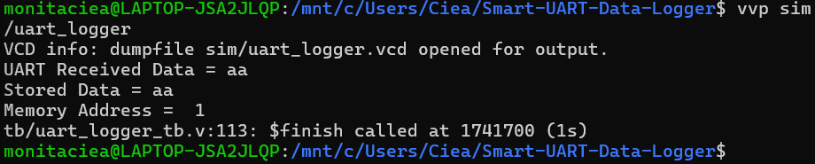
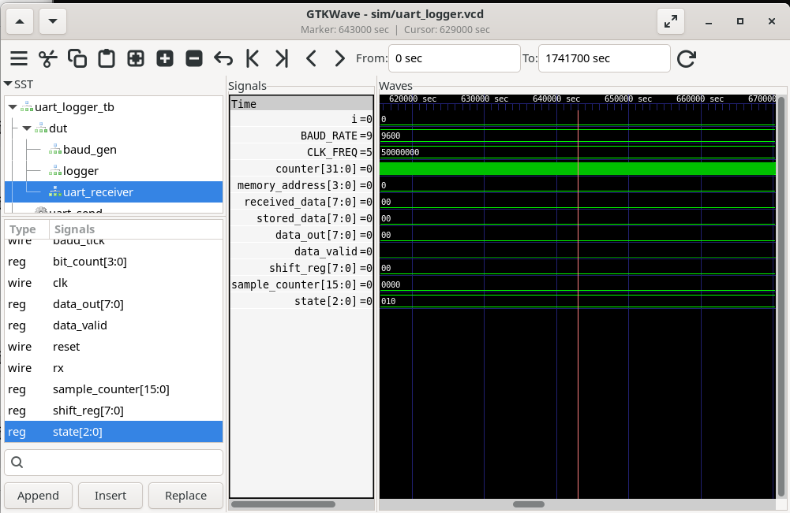
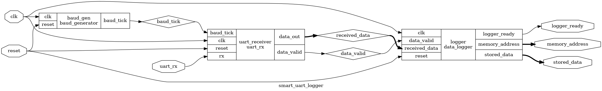

# Smart UART Data Logger using Verilog HDL


A **Register Transfer Level (RTL)** implementation of a **Smart UART Data Logger** using **Verilog HDL**. This project demonstrates the design, verification, and synthesis of a UART receiver capable of receiving serial data, converting it into parallel format, validating the UART frame, and storing the received data in a memory buffer.

The design follows a modular architecture consisting of a **Baud Rate Generator**, **UART Receiver**, and **Data Logger**, with an **FSM-based control mechanism** for reliable UART communication. The complete RTL design flow includes **functional simulation using Icarus Verilog**, **waveform analysis using GTKWave**, and **RTL synthesis using Yosys**.

---

# Features

- UART Receiver implementation
- Baud Rate Generator
- Start Bit Detection
- 8-bit Serial-to-Parallel Data Conversion
- Stop Bit Verification
- FSM-Based UART Control
- Memory Buffer for Data Logging
- Data Ready Indication
- Modular and Synthesizable RTL Design
- Functional Verification using Verilog Testbench
- Waveform Analysis using GTKWave
- RTL Synthesis using Yosys

---

# Design Architecture

The Smart UART Data Logger consists of three major RTL modules:

- **Baud Generator** – Generates UART baud timing.
- **UART Receiver** – Receives serial UART data and converts it into an 8-bit parallel byte.
- **Data Logger** – Stores the received byte into a memory buffer and generates a data-ready signal.

## Block Diagram

```text
                 UART Serial Input
                        │
                        ▼
              +-------------------+
              | Baud Generator    |
              +-------------------+
                        │
                        ▼
              +-------------------+
              | UART Receiver     |
              +-------------------+
                        │
                 Received Data
                        │
                        ▼
              +-------------------+
              | Data Logger       |
              | Memory Buffer     |
              +-------------------+
                        │
                        ▼
                Logged Data Output
```

---

# FSM Design

The UART Receiver is implemented using a **Finite State Machine (FSM)** to control the reception of UART frames.

## FSM States

| State | Description |
|--------|-------------|
| **IDLE** | Waits for UART communication and monitors the RX line. |
| **START_BIT** | Detects and validates the UART Start Bit. |
| **RECEIVE_DATA** | Receives 8 serial data bits and performs Serial-to-Parallel conversion. |
| **STOP_BIT** | Validates the Stop Bit and completes the UART frame. |
| **STORE_DATA** | Stores the received byte into the memory buffer. |
| **DONE** | Generates the Data Ready signal and returns to the IDLE state. |

## FSM Diagram

```text
           +-------+
           | IDLE  |
           +-------+
               │
               ▼
        +-------------+
        | START BIT   |
        +-------------+
               │
               ▼
        +-------------+
        | RECEIVE DATA|
        +-------------+
               │
               ▼
        +-------------+
        |  STOP BIT   |
        +-------------+
               │
               ▼
        +-------------+
        | STORE DATA  |
        +-------------+
               │
               ▼
           +-------+
           | DONE  |
           +-------+
               │
               └────────────► IDLE
```

---

# Project Structure

```text
Smart-UART-Data-Logger
│
├── LICENSE
├── README.md
├── synth.ys
│
├── rtl
│   ├── baud_generator.v
│   ├── uart_rx.v
│   ├── data_logger.v
│   └── smart_uart_logger.v
│
├── tb
│   └── uart_logger_tb.v
│
├── sim
│
└── images
    ├── block_diagram.png
    ├── fsm_diagram.png
    ├── simulation_result.png
    ├── gtkwave_simulation_waveform.png
    └── yosys_rtl_schematic.png
```

---

# Tools Used

| Tool | Purpose |
|------|---------|
| Verilog HDL | RTL Design |
| Icarus Verilog | Functional Simulation |
| GTKWave | Waveform Analysis |
| Yosys | RTL Synthesis |
| Ubuntu (WSL) | Development Environment |

---

# How to Run

## Compile

```bash
iverilog -o sim/uart_logger rtl/*.v tb/uart_logger_tb.v
```

## Run Simulation

```bash
vvp sim/uart_logger
```

### Expected Output

The simulation successfully receives the UART data (`0xAA`), stores it into the memory buffer, and updates the memory address after successful frame validation.

### Simulation Result



```text
UART Received Data = aa
Stored Data = aa
Memory Address = 1
```

## View Waveform

```bash
gtkwave sim/uart_logger.vcd
```

Running the simulation automatically generates the `uart_logger.vcd` waveform file, which can be viewed using GTKWave.

---

# RTL Synthesis

Run the synthesis script using Yosys:

```bash
yosys synth.ys
```

The synthesis process verifies that the RTL design is synthesizable and generates the RTL hardware schematic.

---

# Results

The Smart UART Data Logger successfully demonstrates the complete UART reception and data logging process.

### Successfully Verified

- UART Start Bit Detection
- 8-bit Serial Data Reception
- Serial-to-Parallel Data Conversion
- Stop Bit Validation
- Memory Buffer Storage
- Data Ready Signal Generation
- Functional Simulation using Icarus Verilog
- Waveform Verification using GTKWave
- RTL Synthesis using Yosys

---

# GTKWave Simulation Waveform

The waveform below verifies the UART communication sequence, serial-to-parallel conversion, and successful data storage.



---

# RTL Schematic (Yosys)

The RTL schematic generated by Yosys confirms that the design is synthesizable and illustrates the hardware implementation of the Smart UART Data Logger.



---

# Learning Outcomes

This project provided hands-on experience with:

- UART Communication Protocol
- Finite State Machine (FSM) Design
- RTL Design using Verilog HDL
- Modular Hardware Design
- Serial-to-Parallel Data Conversion
- Testbench Development
- Functional Verification
- Waveform Analysis using GTKWave
- RTL Synthesis using Yosys
- Complete Digital Design Flow

---

# Future Improvements

Potential enhancements include:

- UART Transmitter implementation
- Configurable Baud Rate Selection
- FIFO-Based Data Buffer
- Parity Bit Generation and Checking
- Configurable Data Width
- Interrupt Support
- APB/AXI Peripheral Interface
- FPGA Implementation and Hardware Validation

---

# Author

**Monita Ciea Salins**

Electronics and Communication Engineering Student

**Areas of Interest:** VLSI Design • RTL Design • Digital Design • FPGA • ASIC Design • Verilog HDL

- **GitHub:** https://github.com/Monita-Ciea
- **LinkedIn:** https://www.linkedin.com/in/monita-ciea-salins-a76583298/

---

# License

This project is licensed under the **MIT License**.
